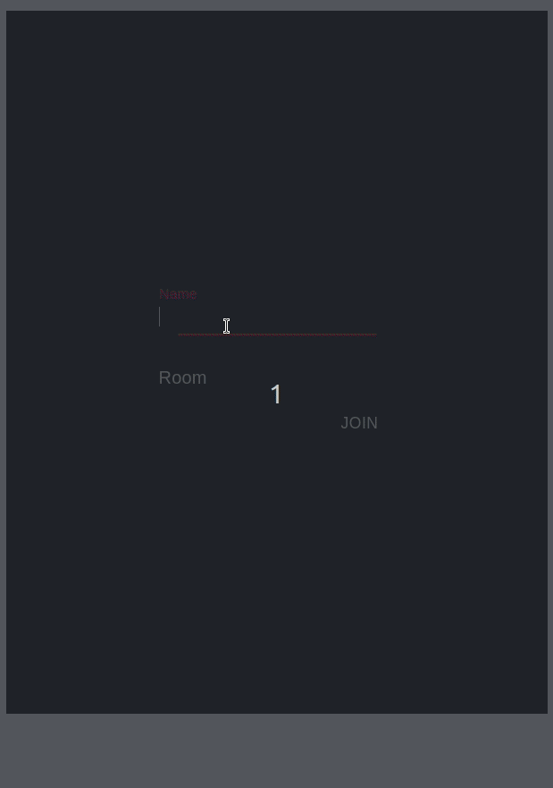

# ABOUT
ChatRooms app I build for assignment of a friend. 

## To Run

As Simple Program

```
1. git clone https://github.com/s-mrb/Chat-Room
2. cd Chat-Room
3. (cd server && npm install && npm start) & (cd client && yarn install && yarn start)


```

<br />

As Docker Container

```
1. git clone https://github.com/s-mrb/Chat-Room
2. cd Chat-Room
3. sudo ./setup-docker.sh

```


### Sample
<div style="text-align:center">

</div>


